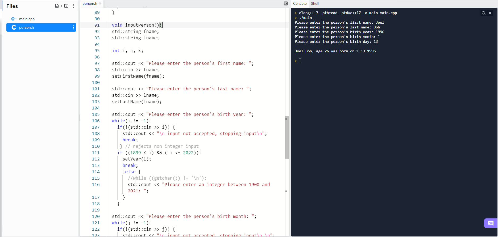

# Data Structures 2
 ### Assignment 2 for Data Structures at Northeastern State University
 
 ### Basic example of the use of a Class
 
 The user is prompted through the console to enter information that will be stored as a "person" object. The user is prompted to enter 2 strings for the person's first and last names, along with 3 integers for the person's birth year, day, and month. The person's age is calculated by comparing the persons birthday to the current machine time.

 #### Person class
 ```
class person{
  private:
  std::string fname;
  std::string lname;
  int day;
  int month;
  int year;
  int age;
 ```
 
 The main function is very simple with a "person" object being instantiated, and the person.inputPerson() function being called. The new person is then printed to the screen. 

 #### Main
```
#include <iostream>
#include "person.h"

int main() {
  person input;
  input.inputPerson();
  std::cout << input << "\n";
}
```

#### Example of the program being run, and data being entered.



